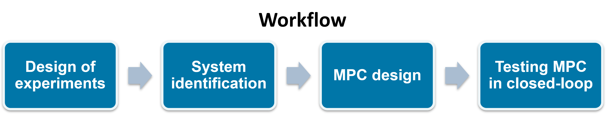
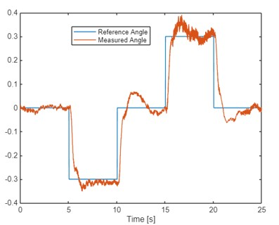
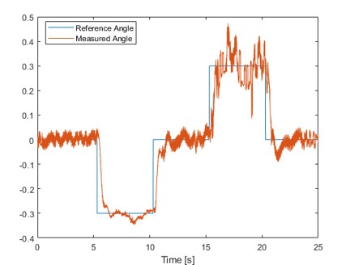

# Advanced Control using the Arduino-Based Bi-Copter

This repo contains MATLAB® code and Simulink® models for conducting advanced control experiments with the low-cost balancing bi-copter. These experiments facilitate hands-on exploration of topics such as system identification and model predictive control (MPC) design. The bi-copter hardware was developed by Prof. Enikov at the University of Arizona. 3D printing and assembly instructions can be accessed [here](https://github.com/eenikov/Arduino-based-bi-copter-experiments/tree/main).

## Bi-copter control using MPC
  

Bi-copter is controlled using MPC to keep the arm at the given reference angles.

  

MPC provides satisfactory control even in the presence of disturbance - the extra weight attached to the bi-copter arm.

  

to learn how to perform system identification experiments and design an MPC for controlling the bi-copter.

## Products

Requires MATLAB release R2024a or newer
- [MATLAB](https://www.mathworks.com/products/matlab.html)
- [Simulink®](https://www.mathworks.com/products/simulink.html)
- [Model Predictive Control Toolbox™](https://www.mathworks.com/products/model-predictive-control.html)
- [System Identification Toolbox™](https://www.mathworks.com/products/sysid.html)

## Resources
- [MPC Tech Talks](https://www.mathworks.com/videos/series/understanding-model-predictive-control.html)
- [Teaching Control Systems with MATLAB and Simulink](https://www.mathworks.com/solutions/control-systems/teaching-control-systems.html)

## License
The license is available in the License.txt file in this GitHub repository.

Copyright 2025 The MathWorks, Inc.
